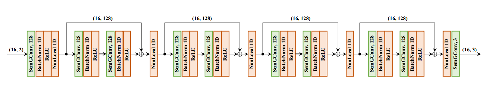
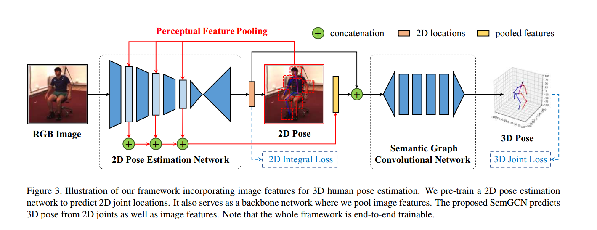

# DGCN-pose

Q: channel-wise gcn到底有没有效果。作者未给出Ablation实验

SemGCN:

总参数量：434703

***代码复现重要参考：

------

图卷积面临的两个问题：

(1) 所有顶点的权重矩阵都是相同的，不能学习到多种特征信息

(2) 参照论文《Semi-supervised classification with graph convolutional networks》，
只选取各顶点的一阶邻域作为卷积核的感知范围（感受野较小）

SemGCN通过non-local将局部特征和全局特征融合;

non-local与KNN的主要区别在于计算相似性的方式不同(都是pairwise distance)

KNN不能直接用在2d joint进行最近邻的选取，点云图是无向的，human skeleton图是有向的(实际上在图卷积里面似乎也是无向的，邻接矩阵是对称的)

------

### Q1：怎么将Human3.6M视频转换为图片

不同的论文有不同的做法，获取的图片数量也不一样

SemGCN采用了和《Towards 3D Human Pose Estimation in the
Wild: a Weakly-supervised Approach》[pytorch-pose-hg-3d](https://github.com/xingyizhou/pytorch-pose-hg-3d), 
the videos are downsampled from 50fps to 10fps for both the training and testing sets to reduce redundancy. 

# 数据要点

data_2d_h36m的数据格式： subject, action, camera, joints, dims

增加2D reconstruction loss

------
data = np.load('data/data_2d_h36m_gt.npz', allow_pickle=True, encoding='latin1')

data['metadata']   % {'num_joints': 16, 'keypoints_symmetry': [[4, 5, 6, 10, 11, 12], [1, 2, 3, 13, 14, 15]]}
data['positions_2d']  % subject, action, camera, joints, dims=2

------

data = np.load('data/data_3d_h36m.npz', allow_pickle=True, encoding='latin1')
positions = data['positions_3d']   # subject, action, camera, joint, dims=3

## 2019-9-14

TODO：

2. 增加在新数据集上的测试结果：MPI-INF-3DHP (找一个开源代码)
3. 增加余弦退火学习率

Down:

1. 增加评估标准： N-MPJPE (EpipolarPose比较了不同论文的NMPJPE)
2. 增加ground-truth self-supervised projection module  (2019-9-14已完成)
3. 实现bone-length loss以及bone_symmetry_loss
4. 实现camera_network + pose_estimation_network联合训练

在调参阶段需要继续做的事情：

a. data augmentation

------

2019-9-19:

(1) 增加2D pose estimaton，实现stacked hourglass、hrnet、Openpose、Alphapose

(3) 复现image features模块,以及《In the Wild Human Pose Estimation Using Explicit 2D Features and Intermediate 3D Representations》论文中的思想

需要增加integral loss，预训练2D pose estimation network并在Human3.6M上进行微调，需要消耗大量时间

！暂时不做这个模块，在预测的时候能够实现以图片为输入即可！！！

------

2019-9-21

阅读ICCV2019图卷积最新工作

2019-9-23:

实现多个loss分阶段训练(参考https://blog.csdn.net/zseqsc_asd/article/details/90673255，分阶段训练多个loss，最后联合训练)：

前10个epoch只训练3d position loss

5. 在3D pose estimation network上做改动, non-local与graph attention
6. 增加Pose refinement，参考CVPR19最新工作(不可行)
7. 将图卷积的网络框架同时应用于3D hand pose estimation以及Human/Hand reconstruction

----SemGCN中的three-stage training

1. 利用2d ground truth 训练 2D pose estimation network

结构为Integral human pose regression中设计的结构(结合了integral loss并且有imagenet预训练权重)，
没有采用openpose或者stacked hourglass

2. 固定2D pose estimation模块，以前者的输出 + 3D ground truth训练GCN进行2D pose到3D pose的回归
   此处采用Eq. 7中定义的joint loss + bone loss

3. 使用所有的数据对整个网络进行fine tune

为了简单，先只做第二个部分

[MDN-tensorflow](https://github.com/chaneyddtt/Generating-Multiple-Hypotheses-for-3D-Human-Pose-Estimation-with-Mixture-Density-Network)

需要修改数据集路径:

- data/
    - S1
        - MyPoses
        - StackedHourglassFineTuned240
    - S11
        - MyPoses
        - StackedHourglassFineTuned240
    - S5
        - MyPoses
        - StackedHourglassFineTuned240
    - S6
        - MyPoses
        - StackedHourglassFineTuned240
    - S7
        - MyPoses
        - StackedHourglassFineTuned240
    - S8
        - MyPoses
        - StackedHourglassFineTuned240
    - S9
        - MyPoses
        - StackedHourglassFineTuned240
        
        
        
-------20190929-----------

1. MDN_pytorch结合VideoPose3D的训练与测试(已完成)

Note：调整clip的范围；最终的测试结果以5个hypothesis中MPJPE最小的结果作为最终的预测结果

2. 增加ActionWise的测试

3. 实现5个hypothesis的可视化

4. MDN tensorflow转pytorch

-------20191007-----------

将Linear architecture换成SemGCN

通过与SemGCN中的linear_model对比发现，GPU占用率低是正常的，可能是因为模型参数量少，数据读取占

-------20191008-----------

之前一直只训练了3D loss，MPJPE只能降到61mm

------
写一个综述？